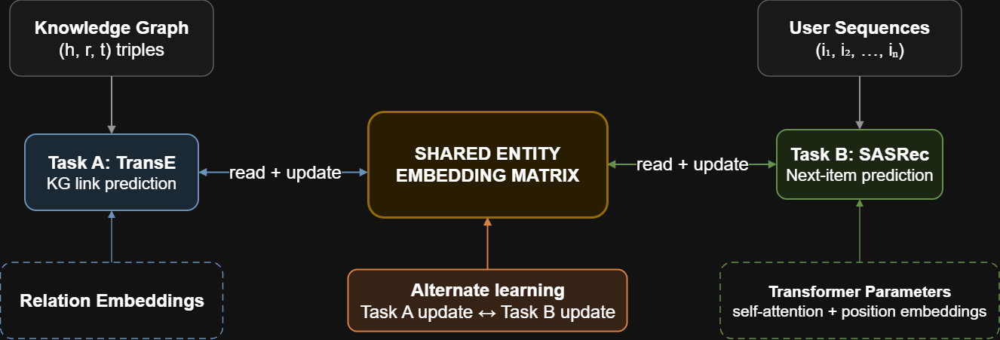

# Knowledge Graph-Enhanced Sequential Recommendation

This repository contains the implementation and experimental evaluation of a Knowledge Graph-enhanced sequential recommendation architecture based on **shared entity embeddings** and **alternate learning**.

The project was originally developed for an industrial B2B spare-parts
recommendation scenario and was subsequently evaluated on Amazon Fashion data
to study its generalizability beyond the original domain.

The experimental pipeline combines:

```text
Knowledge Graph Embedding
        +
Sequential Recommendation
        +
Shared Embedding
        +
Alternate Learning
```

The main idea is to represent items in a single embedding space that is updated
by both:

```text
Task A: Knowledge Graph link prediction with TransE
Task B: Sequential recommendation with SASRec
```

This makes structural Knowledge Graph information and sequential user behavior
interact directly during training.

## Repository Structure

```text
KG_RS/
├── README.md
│
├── knowledge_graph/
│   └── B2B Knowledge Graph construction and KGE training
│
├── SASRec/
│   └── standalone B2B SASRec baseline
│
├── B2B_alternate_learning/
│   └── B2B shared-embedding alternate-learning architecture
│
├── fashion_generalization/
│   └── Fashion datasets, preprocessing, models and alternate learning
│
├── ablation_study/
│   └── B2B and Fashion Knowledge Graph ablation experiments
│
├── comparison_analysis/
│   └── B2B/Fashion dataset comparison analyses
│
├── dataset/
│   └── B2B recommendation data used by the sequential models
│
├── data/
│   └── processed B2B Knowledge Graph data
│
└── results/
    └── retained B2B experiment artifacts and checkpoints
```

Each major directory contains its own README with additional implementation,
execution, and result details.

# 1. Experimental Domains

The architecture is evaluated in two substantially different recommendation
settings:

```text
Industrial B2B spare parts
Amazon Fashion
```

This makes it possible to study whether Knowledge Graph information remains
useful across domains with very different interaction patterns, item
distributions, and graph semantics.

# 2. B2B Dataset

The original experimental domain is an industrial B2B spare-parts
recommendation scenario.

The data originate from historical transactions collected through an
industrial spare-parts platform.

The released experimental data are anonymized.

The interaction data contain information about:

```text
customers
items
machines
product models
orders
timestamps
```

The B2B Knowledge Graph is generated from the training portion of the
interaction data.

The complete graph contains five relation types:

```text
owns
compatible_with
bought
instance_of
compatible_with_model
```

The final B2B Knowledge Graph used for the reported experiments contains:

```text
24,900 entities
206,688 training triples
5 relation types
```

The `compatible_with` relation is split into training, validation, and test
sets for Task A link-prediction evaluation.

The processed graph files are stored under:

```text
data/processed/
```

and include:

```text
kg_train.tsv
taskA_valid.tsv
taskA_test.tsv
kg_stats.json
```

The filtered Knowledge Graphs used for the ablation experiments are stored
under:

```text
data/processed/ablation/
```

# 3. Fashion Dataset

The Fashion generalization experiments are based on the **Amazon Review Data
(2018)** collection released by the UCSD McAuley Lab:

[Amazon Review Data (2018) — UCSD](https://cseweb.ucsd.edu/~jmcauley/datasets/amazon_v2/)

Specifically, the experiments use the **Clothing, Shoes and Jewelry** category,
including both interaction data and product metadata.

The corresponding raw files are:

```text
Clothing_Shoes_and_Jewelry.json.gz
meta_Clothing_Shoes_and_Jewelry.json.gz
```

These raw files are **not included in this repository** because of their size.
They can be downloaded from the original dataset page and should be placed
under:

```text
fashion_generalization/data/raw/
```

resulting in:

```text
fashion_generalization/data/raw/
├── Clothing_Shoes_and_Jewelry.json.gz
└── meta_Clothing_Shoes_and_Jewelry.json.gz
```

The preprocessing scripts contained in this repository generate the filtered
interaction datasets, RecBole files, and Knowledge Graph inputs used by the
experiments.

Fashion is intentionally very different from the B2B setting.

Compared with the industrial data, Fashion contains:

```text
many more users
many more items
much shorter interaction sequences
substantially lower repeat behavior
different Knowledge Graph semantics
```

Two Fashion experimental pipelines are maintained in this repository.

## Fashion-Random

Fashion-Random uses a random sample of approximately:

```text
50,000 users
```

The original Knowledge Graph contains three relation types:

```text
compatible_with
belongs_to
belongs_to_brand
```

The compatible_with relation is derived from cross-category also_buy
relationships and represents the main item-to-item structural signal used in
the Fashion experiments.

The main Fashion-Random configuration uses:

```text
TransE embedding dimension = 64
SASRec hidden dimension    = 64
```

The standalone SASRec model was tuned independently on this dataset.

An enriched Fashion-Random Knowledge Graph was also constructed for the ablation
experiments by adding engineered price and popularity information.

## Fashion-Heavy

Fashion-Heavy uses a different user-selection strategy from Fashion-Random.

Instead of randomly sampling users, users are ranked according to the number
of distinct Fashion macro-categories in their interaction histories and,
secondarily, by their number of interactions.

The resulting dataset contains:

```text
49,988 users
```

This produces a different interaction dataset from Fashion-Random.

For this reason, both TransE and SASRec are tuned independently for this
setting rather than reusing the Fashion-Random hyperparameters.


### 3-relation KG

```text
compatible_with
belongs_to
belongs_to_brand
```

### 5-relation KG

The enriched graph additionally contains:

```text
belongs_to_price_tier
belongs_to_pop_tier
```

The 5-relation graph therefore evaluates whether engineered price and
popularity information provides useful structural information beyond
compatibility, category, and brand.

Fashion-Heavy uses:

```text
TransE embedding dimension = 128
SASRec hidden dimension    = 128
```

The complete Fashion implementation is available under:

```text
fashion_generalization/
```

# 4. Experimental Pipeline

The architecture is organized into four main steps.

```text
Step 1
Knowledge Graph construction
        |
        v
Step 2
Knowledge Graph Embedding pretraining
        |
        v
Step 3
Standalone SASRec pretraining
        |
        v
Step 4
Shared-Embedding Alternate Learning
```

# 5. Step 1 - Knowledge Graph Construction

For B2B, the graph is generated from the recommendation training data.

The main script builds the five relations and produces:

```text
kg_train.tsv
taskA_valid.tsv
taskA_test.tsv
kg_stats.json
```

The corresponding implementation is located under:

```text
knowledge_graph/
```

The graph can be reconstructed from the repository root using the corresponding
KG construction script.

For example:

```bash
python knowledge_graph/build_kg.py
```

The generated graph can subsequently be validated using:

```bash
python knowledge_graph/validate_kg.py
```

The Fashion Knowledge Graphs are constructed independently under:

```text
fashion_generalization/preprocessing/
```

because their relations and entity types differ from the B2B graph.

# 6. Step 2 - Knowledge Graph Embedding

Several Knowledge Graph embedding models were evaluated on the B2B graph:

```text
TransE
RotatE
DistMult
ComplEx
```

Hyperparameter optimization is performed with Optuna.

The primary Task A evaluation uses type-constrained link prediction for the
`compatible_with` relation.

The reported metrics are:

```text
MRR
Hits@1
Hits@3
Hits@10
```

## B2B KGE Results

| Model | MRR | Hits@10 |
|---|---:|---:|
| **RotatE** | **0.3148** | **0.537** |
| DistMult | 0.2973 | 0.510 |
| TransE | 0.2953 | 0.502 |
| ComplEx | 0.1948 | 0.369 |

RotatE obtains the best isolated link-prediction performance.

However, the final alternate-learning architecture uses **TransE**.

The reason is architectural rather than purely performance-based: TransE uses a
real-valued translational embedding space that can be directly shared with the
real-valued item representations required by SASRec.

The canonical B2B TransE checkpoint is stored under:

```text
results/step2_hpo/TransE/best_model.pt
```

# 7. Step 3 - Standalone SASRec

SASRec is trained independently before constructing the joint model.

The standalone model serves two purposes:

1. it provides the sequential recommendation baseline;
2. its Transformer parameters are used to warm-start Task B in Step 4.

The B2B SASRec hidden dimension is:

```text
400
```

which matches the TransE entity embedding dimension used by the joint model.

For Fashion, the dimensionality is dataset-specific:

```text
Fashion-Random = 64
Fashion-Heavy  = 128
```

Fashion-Heavy uses a new SASRec HPO because its user-selection procedure produces
a different interaction dataset from Fashion-Random.

# 8. Step 4 - Shared-Embedding Alternate Learning

The central component of this repository is the Step 4 architecture.

## KGSEQ Architecture

The KGSEQ architecture combines Knowledge Graph link prediction with TransE
(Task A) and sequential recommendation with SASRec (Task B). Both tasks
directly operate on the same trainable entity embedding matrix and are
optimized through alternate learning.

<p align="center">
  
</p>


Both tasks directly share the same trainable entity embedding matrix.

There is not one item embedding matrix for TransE and another one for SASRec.

There is exactly one shared entity embedding matrix.

When Task A performs backpropagation:

```text
TransE loss
    ↓
SharedEmbedding updated
```

When Task B performs backpropagation:

```text
SASRec loss
    ↓
SharedEmbedding updated
```

Therefore, the representation of an item is influenced by both:

```text
Knowledge Graph structure
sequential interaction behavior
```

# 9. SharedEmbedding

The shared representation is implemented as a single:

```python
torch.nn.Embedding
```

instance.

The same `SharedEmbedding` object is passed to both Task A and Task B.

The implementation is located under:

```text
B2B_alternate_learning/models/shared_embedding.py
```

with corresponding Fashion implementations under:

```text
fashion_generalization/alternate_learning/models/
```

The dimensionality depends on the experiment:

| Domain | Shared dimension |
|---|---:|
| B2B | 400 |
| Fashion-Random | 64 |
| Fashion-Heavy | 128 |

# 10. Unified ID Space

Knowledge Graph libraries and recommendation libraries do not naturally use the
same integer identifiers.

For example:

```text
PyKEEN entity IDs
RecBole item IDs
repository KG IDs
```

are independently generated.

A deterministic **Unified ID Space** is therefore constructed before joint
training.

The unified space:

```text
preserves all KG entities
maps recommendation items to the corresponding KG entities
adds items present in RecBole but absent from the KG
maintains translation tables to/from RecBole IDs
handles the SASRec padding index explicitly
```

This is essential because the same row of `SharedEmbedding` must always refer
to the same real-world item regardless of which task accesses it.

The corresponding implementation is provided in:

```text
B2B_alternate_learning/unified_id_space.py
```

and in the Fashion-specific equivalents.

# 11. Warm Start

The joint architecture is not trained from scratch.

It combines the knowledge learned independently in Steps 2 and 3.

## Task A warm start

The shared entity matrix is initialized from the pretrained TransE entity
representations.

Because PyKEEN and the repository use different entity IDs, weights are copied
by entity identity rather than by raw matrix row.

## Task B warm start

SASRec uses the same shared item representations rather than creating a new
private item embedding matrix.

The pretrained RecBole SASRec checkpoint is used to initialize the sequential
model components, including:

```text
position embeddings
Transformer layers
self-attention parameters
feed-forward layers
layer normalization
```

The original standalone SASRec item embedding is intentionally not used as a
second independent item matrix.

This preserves the shared-embedding design.

# 12. Task A - TransE

Task A performs Knowledge Graph link prediction.

Entity representations are obtained directly from `SharedEmbedding`.

Relation embeddings remain Task-A-specific.

For a triple:

```text
(h, r, t)
```

TransE evaluates the translational relation:

```text
h + r ≈ t
```

Task A therefore pushes shared entity embeddings toward representations that
preserve Knowledge Graph structure.

# 13. Task B - SASRec

Task B performs sequential recommendation.

The sequence item IDs are first translated into the unified ID space and then
looked up directly in `SharedEmbedding`.

The resulting representations are passed through:

```text
position embeddings
causal self-attention
Transformer encoder
final sequence representation
```

Candidate items are also retrieved from the same shared matrix.

Recommendation scores are computed through the dot product between:

```text
user sequence representation
        ×
shared candidate-item representation
```

No separate projection is required when the SASRec hidden dimension and the
shared embedding dimension match.

# 14. Alternate-Learning Schedules

Two main training schedules are evaluated.

## `one_to_one`

Task A and Task B updates are alternated at a fine-grained level.

Conceptually:

```text
Task A update
Task B update
Task A update
Task B update
...
```

## `epoch`

The tasks are alternated at epoch level.

Conceptually:

```text
Task A epoch
Task B epoch
Task A epoch
Task B epoch
...
```

The architecture therefore remains identical while changing the frequency at
which the two objectives influence the shared representation.

# 15. Loss Functions

For the B2B experiments, Task B uses the ranking-based sequential recommendation
objective selected for the original architecture.

For Fashion, both BPR and Cross-Entropy were explicitly compared.

Cross-Entropy clearly outperformed BPR on NDCG@20 and is therefore used for the
final Fashion experiments.

# 16. Running the Repository

## Git LFS

This repository uses **Git Large File Storage (Git LFS)** for large model
checkpoints and B2B dataset files.

Git LFS is required to retrieve these files correctly.

Before cloning the repository, install Git LFS following the instructions for
your operating system:

https://git-lfs.com/

Then initialize it once on your machine:

```bash
git lfs install
```

Clone the repository normally:

```bash
git clone https://github.com/Infraste03/KGE_RS.git
cd KGE_RS
```

Git LFS files are downloaded automatically during cloning.

If the repository was cloned before Git LFS was installed, run:

```bash
git lfs install
git lfs pull
```

Large files currently managed through Git LFS include:

```text
B2B dataset files
pretrained SASRec checkpoints
pretrained TransE/KGE checkpoints
selected Step 4 model checkpoints
Fashion pretrained checkpoints
```

Raw Amazon Fashion files are not tracked through Git LFS and must instead be
downloaded separately from the original dataset source, as described in the
Fashion Dataset section.

The repository is designed to be executed from the repository root.

A typical local environment can be created with:

```bash
python -m venv .venv
```

Linux / HPC:

```bash
source .venv/bin/activate
```

Windows PowerShell:

```powershell
.venv\Scripts\Activate.ps1
```

Dependencies should match the versions used for the reported experiments.
Install the required Python dependencies:

```bash
pip install -r requirements.txt
```
GPU execution is strongly recommended for:

```text
KGE HPO
SASRec HPO
alternate learning
multi-seed experiments
ablation retraining
```


## B2B Workflow

### Step 1 - Build the KG

```bash
python knowledge_graph/build_kg.py
```

### Validate the KG

```bash
python knowledge_graph/validate_kg.py
```

### Step 2 - KGE HPO

Use the KGE HPO runner under:

```text
knowledge_graph/
```

to optimize:

```text
TransE
RotatE
DistMult
ComplEx
```

The final artifacts are stored under:

```text
results/step2_hpo/
```

### Step 3 - SASRec

Standalone B2B SASRec experiments are contained under:

```text
SASRec/
```

The corresponding README documents training and evaluation.

### Step 4 - Alternate Learning

The main implementation is:

```text
B2B_alternate_learning/
```

The principal runners are:

```text
run_hpo_step4.py
run_step4.py
run_step4_ablation.py
```

Configuration files are under:

```text
B2B_alternate_learning/configs/
```

HPC execution scripts are under:

```text
B2B_alternate_learning/hpc/
```

The public SLURM scripts use portable repository paths and document the
cluster-specific settings that must be adapted before execution.

## Fashion Workflow

The complete Fashion workflow is located under:

```text
fashion_generalization/
```

and includes:

```text
preprocessing/
models/
alternate_learning/
results/
exploration/
hpc/
```

Fashion-Random and Fashion-Heavy use separate preprocessing and model
configurations because they correspond to different user-selection strategies
and interaction datasets.

# 17. Main B2B Results

Final B2B results are computed over five random seeds:

```text
2020
42
1024
999
2024
```

| Model | Scheduling | Recall@20 | NDCG@20 |
|---|---|---:|---:|
| SASRec baseline | - | 0.3452 ± 0.0185 | 0.1840 ± 0.0074 |
| KGSEQ | `one_to_one` | **0.4612 ± 0.0177** | 0.2773 ± 0.0098 |
| KGSEQ | `epoch` | 0.4566 ± 0.0152 | **0.2783 ± 0.0101** |

KGSEQ model substantially improves both Recall@20 and NDCG@20 over the
standalone SASRec baseline.

For the paired five-seed comparison:

```text
Wilcoxon signed-rank p = 0.0312
```

for both Recall@20 and NDCG@20.

# 18. Main Fashion-Random Results

The standalone five-seed SASRec baseline obtains:

| Model | Recall@20 | NDCG@20 |
|---|---:|---:|
| SASRec | 0.0966 ± 0.00023 | 0.0889 ± 0.00016 |

BPR and Cross-Entropy were compared during Step 4 HPO:

| Task B loss | Scheduling | Recall@20 | NDCG@20 |
|---|---|---:|---:|
| BPR | `one_to_one` | 0.0946 | 0.0501 |
| BPR | `epoch` | 0.1017 | 0.0563 |
| CE | `one_to_one` | 0.1039 | 0.0908 |
| CE | `epoch` | 0.1039 | 0.0914 |

Cross-Entropy was therefore selected for the final Fashion experiments.

Using the five reported seeds, the final aggregate results are:

| Model | Scheduling | Recall@20 | NDCG@20 |
|---|---|---:|---:|
| SASRec baseline | - | 0.0966 ± 0.00023 | 0.0889 ± 0.00016 |
| KGSEQ | `one_to_one` | **0.10366 ± 0.00044** | **0.09083 ± 0.00041** |
| KGSEQ | `epoch` | 0.10324 ± 0.00057 | 0.09032 ± 0.00065 |


The paired KGSEQ-vs-SASRec comparison gives:

```text
p = 0.0312
```

for both metrics and both scheduling strategies.

The difference between `one_to_one` and `epoch`, however, is not statistically
significant with five seeds.

# 19. Main Fashion-Heavy Results

Fashion-Heavy standalone SASRec obtains:

| Model | Recall@20 | NDCG@20 |
|---|---:|---:|
| SASRec | 0.09088 ± 0.00034 | 0.07734 ± 0.00023 |

The final one-to-one shared-embedding models obtain:
| Model | KG | Recall@20 | NDCG@20 |
|---|---|---:|---:|
| KGSEQ | 3-rel | **0.09796 ± 0.00028** | **0.08046 ± 0.00014** |
| KGSEQ | 5-rel | 0.09783 ± 0.00035 | 0.08041 ± 0.00008 |

Both KGSEQ configurations significantly outperform standalone SASRec:

```text
p = 0.0312
```

for both Recall@20 and NDCG@20.

The comparison between the 3-rel and 5-rel configurations is not significant:

```text
Recall@20: p = 0.8125
NDCG@20 : p = 0.6250
```

Therefore, adding the engineered price-tier and popularity-tier relations does
not produce a measurable downstream recommendation improvement in this
experiment.

# 20. Knowledge Graph Ablation Study

Ablation experiments are performed in two stages.

## Stage 1 - Isolated KGE ablation

Relations are removed or selectively retained and TransE is retrained.

This measures the effect of graph composition directly on link prediction.

Metrics:

```text
MRR
Hits@10
```

## Stage 2 - Downstream alternate-learning ablation

Selected Stage 1 configurations are then propagated into the shared-embedding
recommendation architecture.

Metrics:

```text
Recall@20
NDCG@20
```

This distinction is important because a relation that improves isolated
Knowledge Graph reconstruction does not necessarily improve downstream
recommendation.

The complete ablation implementation is located under:

```text
ablation_study/
```

# 21. B2B Ablation Results

## Stage 1 - Isolated TransE

| KG configuration | MRR | Hits@10 |
|---|---:|---:|
| Full graph | 0.2953 | 0.5020 |
| Without `bought` | 0.2285 | 0.4083 |
| Without `compatible_with` | 0.0151 | 0.0321 |
| Without `compatible_with_model` | 0.2962 | 0.4999 |
| Without `instance_of` | 0.2988 | 0.5082 |
| Without `owns` | 0.2931 | 0.5078 |
| `compatible_with` + `owns` | 0.2139 | 0.3778 |
| `bought` + `owns` | 0.0111 | 0.0229 |
| `bought` + `compatible_with` | 0.2938 | 0.5026 |
| `compatible_with` + `compatible_with_model` | 0.2224 | 0.3978 |
| `compatible_with` + `instance_of` | 0.2051 | 0.3629 |
| `compatible_with` only | 0.2137 | 0.3837 |
| `compatible_with` + `bought` + `instance_of` | 0.2939 | 0.5005 |
| `compatible_with` + `compatible_with_model` + `owns` | 0.2254 | 0.3999 |

The most important result is the collapse observed when `compatible_with` is
removed.

This identifies compatibility as the strongest structural signal for the B2B
link-prediction task.

## Stage 2 - Recommendation Ablation

Five selected variants were subsequently evaluated with five random seeds.

| Relations retained | Recall@20 | NDCG@20 |
|---|---:|---:|
| All five relations | 0.4612 ± 0.0177 | 0.2773 ± 0.0098 |
| All except `compatible_with` | 0.4247 ± 0.0173 | 0.2545 ± 0.0141 |
| `compatible_with` + `owns` | 0.4338 ± 0.0187 | 0.2665 ± 0.0072 |
| `bought` + `compatible_with` + `instance_of` | 0.4566 ± 0.0150 | 0.2691 ± 0.0096 |
| `bought` + `compatible_with` | 0.4612 ± 0.0139 | 0.2771 ± 0.0122 |
| All except `instance_of` | **0.4658 ± 0.0126** | **0.2774 ± 0.0072** |

The downstream experiment confirms the importance of `compatible_with`.

At the same time, `instance_of` appears largely redundant for recommendation:
removing it does not degrade performance.

The reduced graph containing `bought + compatible_with` also reproduces almost
the same recommendation performance as the complete graph.

# 22. Fashion-Random Ablation Results

## Stage 1 - Isolated TransE

| Configuration | MRR |
|---|---:|
| Full | 0.1057 |
| No brand | 0.0907 |
| No category | 0.0946 |
| No `compatible_with` / `also_buy` | **0.0023** |

Again, removing the compatibility signal causes the strongest collapse.

## Stage 2 - Alternate Learning

These experiments use a single seed.

| Configuration | Scheduling | Recall@20 | NDCG@20 |
|---|---|---:|---:|
| No brand | `epoch` | 0.1162 | 0.1063 |
| No brand | `one_to_one` | 0.1165 | 0.1065 |
| No category | `epoch` | 0.1235 | 0.1075 |
| No category | `one_to_one` | 0.1234 | 0.1079 |
| No `compatible_with` | `epoch` | 0.1209 | 0.1083 |
| No `compatible_with` | `one_to_one` | 0.1209 | 0.1086 |
| Full | `epoch` | **0.1235** | **0.1100** |
| Full | `one_to_one` | **0.1235** | 0.1099 |

These ablation values should be interpreted as single-seed diagnostics rather
than multi-seed estimates.

# 23. Fashion-Heavy Ablation Results

## 3-Relation KG - Isolated TransE

| KG configuration | MRR | Hits@10 |
|---|---:|---:|
| Full graph | 0.1010 | 0.1840 |
| Without `belongs_to` | 0.0874 | 0.1707 |
| Without `belongs_to_brand` | 0.0844 | 0.1562 |
| Without `compatible_with` | **0.0004** | **0.0006** |
| `compatible_with` only | 0.0654 | 0.1250 |

## 5-Relation KG - Isolated TransE

| KG configuration | MRR | Hits@10 |
|---|---:|---:|
| Full graph | 0.1033 | 0.1852 |
| Without `belongs_to` | 0.0938 | 0.1672 |
| Without `belongs_to_brand` | 0.0875 | 0.1453 |
| Without `belongs_to_pop_tier` | 0.1050 | 0.1881 |
| Without `belongs_to_price_tier` | 0.1041 | 0.1788 |
| Without `compatible_with` | 0.0005 | 0.0006 |
| `belongs_to` + `belongs_to_pop_tier` | 0.0005 | 0.0012 |
| `belongs_to_pop_tier` + `compatible_with` | 0.0757 | 0.1337 |
| `belongs_to` + `belongs_to_brand` + `compatible_with` | **0.1122** | **0.1875** |
| `compatible_with` + `belongs_to_brand` | 0.0989 | 0.1771 |
| `compatible_with` + `belongs_to` | 0.0902 | 0.1516 |
| `compatible_with` only | 0.0688 | 0.1215 |
| `compatible_with` + `belongs_to_brand` + `belongs_to_price_tier` | 0.0926 | 0.1632 |
| `compatible_with` + `belongs_to` + `belongs_to_pop_tier` | 0.0872 | 0.1499 |

The isolated TransE experiment shows an interesting result: the configuration
retaining `belongs_to`, `belongs_to_brand`, and `compatible_with` outperforms
the complete 5-relation KG in isolated link prediction.

However, this improvement does not transfer directly to downstream
recommendation.

## Fashion-Heavy Stage 2 Ablation

Selected variants were evaluated using seed 2020 and `one_to_one` scheduling.

| KG configuration | KG family | Recall@20 | NDCG@20 |
|---|---|---:|---:|
| Full graph | 5-rel | 0.09786 | 0.08039 |
| Without `compatible_with` | 5-rel | 0.09384 | 0.07900 |
| Without price-tier and popularity-tier | 5-rel | 0.09766 | 0.08033 |
| `compatible_with` + `belongs_to_brand` | 5-rel | 0.09728 | 0.08024 |
| Full graph | 3-rel | 0.09822 | 0.08060 |
| Without `belongs_to` | 3-rel | 0.09692 | 0.08009 |

The isolated-KG advantage of retaining `belongs_to`, `belongs_to_brand`, and
`compatible_with` does not persist in the recommendation task.

This illustrates an important distinction:

```text
better KG reconstruction does not necessarily imply better recommendation
```

# 24. Main Findings

Across the experiments, several consistent patterns emerge.

### Shared Knowledge Graph information improves recommendation

KGSEQ significantly outperforms standalone SASRec in:

```text
B2B
Fashion-Random
Fashion-Heavy 3-rel
Fashion-Heavy 5-rel
```

with:

```text
p = 0.0312
```

for the paired five-seed comparisons.

### Compatibility is the dominant structural relation

Removing `compatible_with` or its Fashion equivalent produces the strongest
drop in isolated KGE performance in every domain.

The B2B downstream ablation confirms that this relation is also important for
recommendation.

### More relations are not always better

The B2B graph can be reduced substantially while maintaining almost the same
recommendation performance.

Similarly, Fashion-Heavy does not obtain a significant downstream improvement from
adding price-tier and popularity-tier relations.

### KGE quality and recommendation quality are related but not equivalent

Some graph configurations improve isolated TransE performance without
improving the downstream recommender.

This is particularly visible in Fashion-Heavy.

### Alternate learning successfully transfers structural information

The improvements over standalone SASRec across both the industrial and Fashion
domains indicate that jointly updating the shared representation allows
Knowledge Graph information to influence sequential recommendation.

# 25. Statistical Tests

The main paired Wilcoxon signed-rank tests use the same five seeds:

```text
2020
42
1024
999
2024
```

## KGSEQ vs SASRec

| Dataset / configuration | Recall@20 p | NDCG@20 p |
|---|---:|---:|
| B2B full | 0.0312 | 0.0312 |
| Fashion-Random `one_to_one` | 0.0312 | 0.0312 |
| Fashion-Random `epoch` | 0.0312 | 0.0312 |
| Fashion-Heavy 3-rel | 0.0312 | 0.0312 |
| Fashion-Heavy 5-rel | 0.0312 | 0.0312 |

## Secondary Comparisons

| Comparison | Recall@20 p | NDCG@20 p |
|---|---:|---:|
| Fashion-Random `one_to_one` vs `epoch`, one-sided | 0.0625 | 0.0938 |
| Fashion-Random `one_to_one` vs `epoch`, two-sided | 0.1250 | 0.1875 |
| Fashion-Heavy 3-rel vs 5-rel, two-sided | 0.8125 | 0.6250 |

The secondary comparisons therefore do not reach statistical significance with
five paired runs.

# 26. Ablation Reproducibility

The complete ablation pipeline is documented under:

```text
ablation_study/
```

It includes:

```text
B2B KG generation
B2B isolated TransE ablation
B2B downstream Step 4 ablation
Fashion-Random ablation
Fashion-Heavy 3-rel ablation
Fashion-Heavy 5-rel ablation
SLURM job-array scripts
result aggregation utilities
```

The generated B2B ablation graphs are stored under:

```text
data/processed/ablation/
```

and the retained isolated B2B TransE outputs under:

```text
results/ablation_transe/
```

# 27. HPC Execution

Long-running experiments were executed using SLURM.

HPC submission scripts are available under:

```text
B2B_alternate_learning/hpc/
fashion_generalization/hpc/
ablation_study/SBATCH FILE/
```

Public SLURM scripts do not contain personal usernames or machine-specific user
paths.

Where an absolute repository path is required, the scripts use a generic
placeholder such as:

```text
/path/to/KG_RS
```

which must be adapted to the target cluster before execution.

# 28. Result Locations

The main B2B artifacts are stored under:

```text
results/
```

including:

```text
Step 2 KGE HPO
Step 4 HPO
SASRec additional seed checkpoints
isolated TransE ablation results
```

Fashion artifacts are maintained under:

```text
fashion_generalization/results/
```

Downstream ablation outputs are collected under:

```text
ablation_study/step4_alternate_results/
```

Fashion-Heavy isolated ablation outputs are under:

```text
ablation_study/fashionv3/
```

# 29. Reproducibility Principles

The repository follows several reproducibility rules.

```text
deterministic entity mappings
fixed random seeds
fixed train/validation/test protocols
shared evaluation metrics
validation-based model selection
multi-seed final evaluation
portable filesystem paths
explicit HPO artifacts
saved model checkpoints
saved training histories
ablation manifests
```

Test-set performance is used for final evaluation, not for hyperparameter
selection.

The selected HPO configurations are determined from validation performance.

# 30. Summary

The repository demonstrates a simple but effective approach to combining
Knowledge Graph structure with sequential recommendation.

The central design choice is not a late fusion of independently trained model
scores.

Instead, both tasks modify the same item representation during training:

```text
KG structure
     ↓
   TransE
     ↓
SharedEmbedding
     ↑
   SASRec
     ↑
user sequences
```

The experiments show that this shared representation improves recommendation
performance in both an industrial B2B domain and Amazon Fashion, while the
ablation studies reveal that the benefit depends strongly on the semantic
relations encoded in the Knowledge Graph.